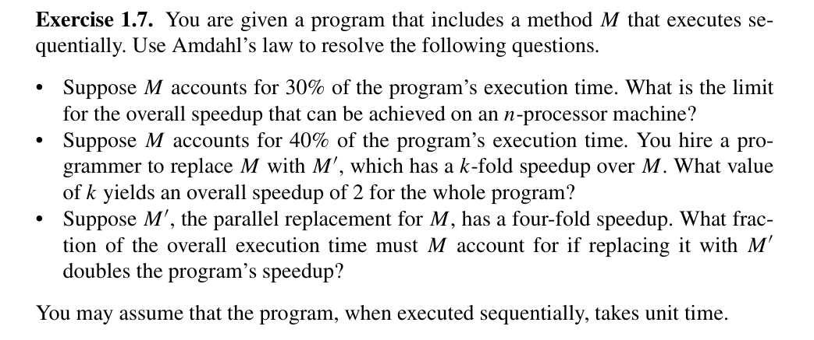
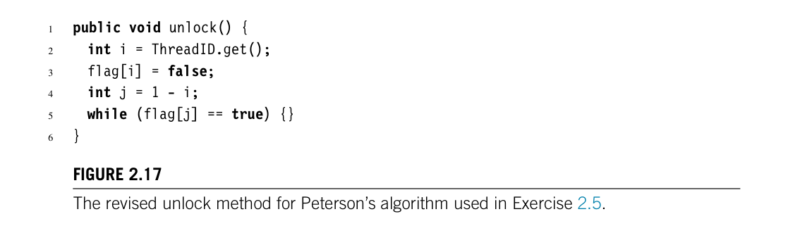
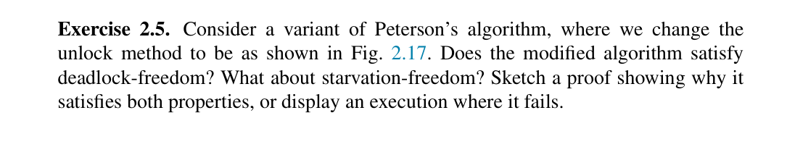
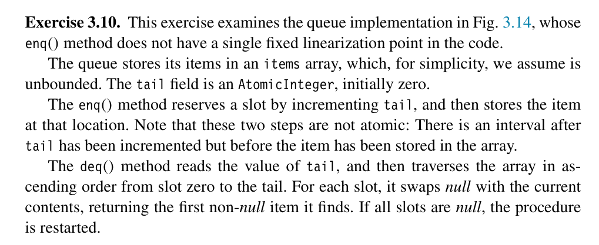
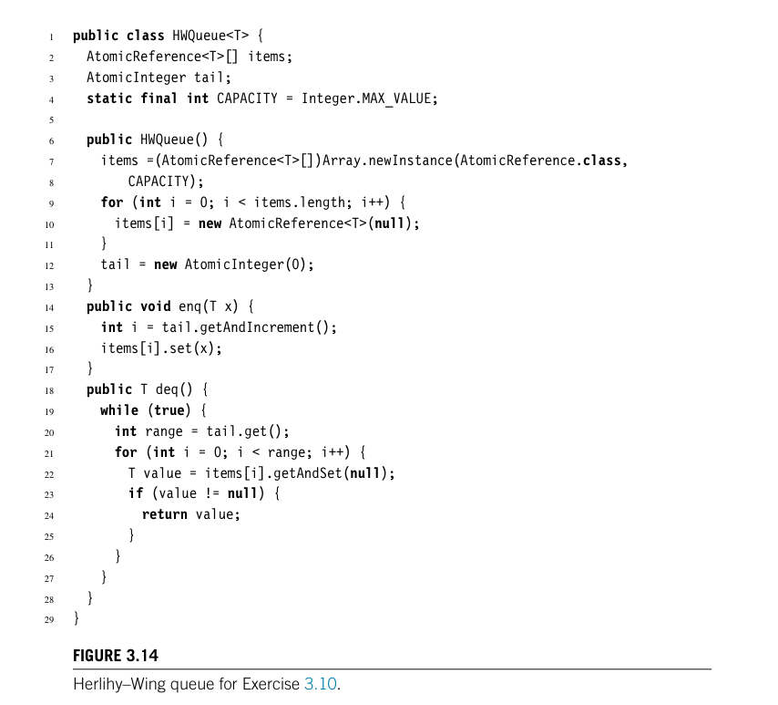
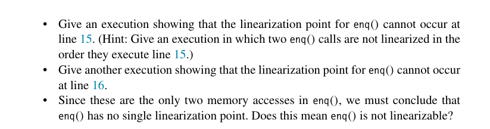

# PNCP - Theory Assignment 1

## CO22BTECH11006

## OM DAVE

### Problem 1

(a) **Amdahl's Law:**

$$
S = \frac{1}{s + \frac{p}{n}}
$$

Where:

- **S** is the maximum speedup,
- **s** is the serial fraction of the program (non-parallelizable),
- **p** is the parallelizable fraction,
- **n** is the number of processors.

The formula simplifies to:

$$
S = \frac{1}{0.3 + \frac{0.7}{n}}
$$

for an n-processor machine.

As $n$ approaches infinity (Theoritical Maximum limit) ($n \to \infty$), the term $\frac{0.7}{n}$ approaches 0, leading to:

$$
S \approx \frac{1}{0.3} \approx 3.33
$$

Thus, the theoretical maximum speedup that can be achieved, regardless of the number of processors, is approximately 3.33.

(b) If M takes t time, then making it k-fold faster, it would take t/k, time, now Since, M
take 0.4 of the unit time, after speed up it would take 0.4/k time. For a system with N processors, the overall speed up is given by:

$$
\frac{1}{\frac{0.4}{k} + \frac{0.6}{N}} = 2
$$

Rearrange to solve for k:

$$
k \cdot N = 0.8 \cdot N + 1.2 \cdot k
$$

$$
k = \frac{0.8 \cdot N}{N - 1.2}
$$

(c) Let **s** be the serial fraction of the program that method M accounts for. Then the parallel fraction of the program is $1 - s$. With a 4-fold speedup for M in an $n$-processor system, the overall speedup is given by:

$$
2 = \frac{1}{\frac{s}{4} + \frac{1 - s}{n}}
$$

$$
\frac{1}{2} = \frac{s}{4} + \frac{1 - s}{n}
$$

$$
s = \frac{2n - 4}{n - 4}
$$

### Problem 2

#### Solution:

**Claim: The revised algorithm is deadlock-free.**

**Explanation:** Possible scenarios of deadlock are:

1. **When both threads are stuck while acquiring a lock.** This is impossible as due to the correctness of the Peterson lock algorithm; due to the presence of a victim, only one thread is able to enter the critical section, and due to the presence of a flag, at least one thread is able to enter. This always ensures progress in the system.

2. **When both threads are stuck while unlocking.** Let thread A be stuck in the unlock loop. At this moment, flag[A] is false, and flag[B] is true. Since flag[A] is false, this means that B, if trying to enter the critical section, would immediately be able to do so. Also, flag[B] is true, which means B is inside the critical section. Now, as soon as B leaves, it sets its flag to false and starts executing the while loop, i.e., while(flag[A] == true) {}. At this moment, the flags of both threads are false, and there is no way to make them true unless one of them exits the unlock method. As both flags are false, at least one of them will leave the unlock method, which contradicts our statement that both of them are stuck at unlock.

3. **When one thread is stuck at unlocking and the other is trying to acquire a lock.** Consider the case when thread A is stuck at unlock with its flag false and flag[B] is true. Now, when B tries to enter, it would see the flag of A, which is false. Since A is already stuck, there is no way that this flag becomes true, which means that B could enter the critical section (breaking the while loop as flag[A] = false), and then subsequently execute unlock leading to case 2, which is also deadlock-free.

So, in any scenario, progress is always possible, so the algorithm is deadlock-free.

**Claim: The algorithm is not starvation-free.**

**Explanation:** Consider this scenario:

Let thread A be stuck in the unlock loop. At this moment, flag[A] is false, and flag[B] is true. Since flag[A] is false, this means that B, if trying to enter the critical section, would immediately be able to do so. Also, flag[B] is true, which means B is inside the critical section. Now, as soon as B leaves, it sets its flag to false and starts executing the while loop, i.e., while(flag[A] == true) {}. At this moment, the flags of both threads are false, and both can exit the unlock method. Now, it could be possible that before A exits its unlock method, thread B exits its unlock, enters the lock method, and sets its flag to true. This makes A unable to exit the unlock method. Also, since flag[A] is still false, B could enter the critical section again. This process could repeatedly happen such that B is re-entering the critical section while A is waiting to exit the unlock method. This could lead to starvation of a particular thread, as in this case thread A.

### Problem 3

#### Solution:

#### Linearization Point at Line 15

In the `enq()` method, line 15 involves the operation `tail.getAndIncrement()`. To demonstrate the non-linearity at this point, consider a scenario where two threads, Thread A and Thread B, are involved. Thread A calls `enq(x)` and Thread B calls `enq(y)`. If Thread A executes `tail.getAndIncrement()` first and receives a value of 0, followed by Thread B which executes the same method and receives the value 1, and then Thread B completes its enqueue operation before Thread A, the final state of the queue does not reflect the order in which these threads accessed the tail. This scenario shows that the operations by Thread A and Thread B on line 15 are not linearized according to the order in which they were executed, so line 15 can't be linearization point.

#### Linearization Point at Line 16

On line 16, where `items[i].set(x)` is executed, If Thread A and Thread B increment the `tail` successfully but Thread B is delayed in executing `items[i].set(y)`, there exists a window where the state of the queue is inconsistent - the `tail` index is updated, but the item has not been set. This delay can lead to a situation where another operation might see an incremented `tail` but an unset item at the new tail index, further proving that the `enq()` operation does not linearize at line 16 either.

#### `enq()` is Linearizable

Given that neither line 15 nor line 16 provides a consistent linearization point and considering that these are the primary operations within the `enq()` method affecting state, it is concluded that `enq()` does not have a single linearization point. However, this does not imply that `enq()` is not linearizable. The method, when viewed as a whole within the context of the queue's operations, can still behave linearly in a broader multi-threaded environment, ensuring overall system correctness and order.
